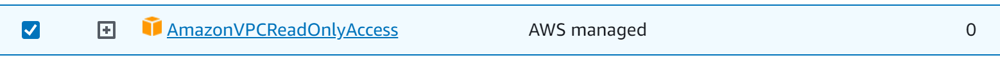

# AWS Prefix Checker

A python script that checks your AWS VPCs' subnets and route tables for overlaps to aid with planning additions and changes.

---

### Dependencies

In addition to Python3, the script has the following python dependencies.


- [Boto3 AWS SDK](https://aws.amazon.com/sdk-for-python/)
- [ipaddress](https://pypi.org/project/ipaddress/)

#### Optionally use the [AWS CLI](https://aws.amazon.com/cli/) to setup and manage security credentials for Boto3 access
---

### Installation

Clone the repository to your environment with https://github.com/admatt01/AWS-Prefix-Checker.git or simply download **prefix-check.py** to your target directory. Follow the instructions for installing the dependencies from the above links.

---
### Setup

The script uses the AWS SDK (Boto3) to read CIDR, Subnet and routing information from your AWS VPC's. To do this it requires programmatic access to your AWS account. This can be obtained by creating Access keys associated with an IAM user that has sufficient privileges for the information Boto3 requires.

- Create an IAM user with sufficient privileges. I am using AdministratorAccess Policy but a **better practise** would be to use a less privileged policy if possible such as AmazonVPCReadOnlyAccess (below)



- Create an Access key for the user, download them and store them securely.
- Install the AWS CLI and run `aws configure` and follow the instructions. This will store your credentials in a hidden folder on your machine, typically **~/.aws/credentials** on Linux systems.

Once this is done the python script is ready to be run and will call on these credentials whenever you run the script.

---
### Usage

The application is mostly self explanortory and will prompt you with simple inputs.

Navigate to the folder containing **prefix-check.py** and run the application:
*Note that on Linux systems you may need to make the file executable. You can do this with: 
```
sudo chmod +x prefix-check.py 
```
Run the application:
```
./prefix-check.py
``````
  ### Usage examples 
  Checking for prefix 172.28.1.0/24 in existing CIDR ranges or route tables. The script will tell you if there is a less specific major net or super net that your prefix query overlaps with and print details of route table entries. It can optionally display the entire route table contents and status including blackholed routes and which route tables contain the prefixes.
```
Enter your AWS region: us-east-1
Enter your VPC ID: vpc-0c095012f2bc3e74e
Enter the IP prefix (CIDR) to check: 172.28.1.0/24
Would you like to display your VPC's Subnets (Yes/No)? No
The entered IP prefix 172.28.1.0/24 is outside the VPC CIDR range.
The entered IP prefix 172.28.1.0/24 conflicts with the following route table entries:
Route Table Entry (Table ID: rtb-07495bcd993ee14fa): 172.28.0.0/16
Would you like to view the route tables (Yes/No)? Yes
Route Tables:
Route Table ID: rtb-051f0724dffebf4a7
Destinations:
- Destination: 10.16.0.0/16, Status: active

Route Table ID: rtb-07495bcd993ee14fa
Destinations:
- Destination: 203.2.132.0/24, Status: active
- Destination: 172.28.0.0/16, Status: blackhole
- Destination: 10.16.0.0/16, Status: active

Would you like to check another prefix (Yes/No)?
``````
Check for overlaps within existing VPC CIDR subnets and optionally display existing subnets.
```
Enter your AWS region: us-east-1
Enter your VPC ID: vpc-0c095012f2bc3e74e
Enter the IP prefix (CIDR) to check: 10.16.0.0/20
Would you like to display your VPC's Subnets (Yes/No)? yes
Existing Subnets:
- Subnet ID: subnet-05a3c23512892a0b9, CIDR: 10.16.112.0/20
- Subnet ID: subnet-0e3ed9e0733fe1081, CIDR: 10.16.64.0/20
- Subnet ID: subnet-09927a19327767f5d, CIDR: 10.16.96.0/20
- Subnet ID: subnet-0d06c13da0505eab2, CIDR: 10.16.128.0/20
- Subnet ID: subnet-0d33c908fec231622, CIDR: 10.16.16.0/20
- Subnet ID: subnet-09544e3a9f6dd8d16, CIDR: 10.16.160.0/20
- Subnet ID: subnet-08569b901014d55bf, CIDR: 10.16.176.0/20
- Subnet ID: subnet-0a17d859922474734, CIDR: 10.16.0.0/20
- Subnet ID: subnet-0e71686bbb9e2b930, CIDR: 10.16.80.0/20
- Subnet ID: subnet-0f4a9d7b4c0577d36, CIDR: 10.16.48.0/20
- Subnet ID: subnet-0f9a1906cda96bca1, CIDR: 10.16.32.0/20
- Subnet ID: subnet-0985ce722d6174545, CIDR: 10.16.144.0/20
The entered IP prefix 10.16.0.0/20 overlaps with an existing subnet: 10.16.0.0/20
The entered IP prefix 10.16.0.0/20 conflicts with the following existing subnets:
Subnet CIDR: 10.16.0.0/20
Would you like to view the route tables (Yes/No)?
``````
Test for overlaps when working with a more specific prefix mask.
```
Enter your AWS region: us-east-1
Enter your VPC ID: vpc-0c095012f2bc3e74e
Enter the IP prefix (CIDR) to check: 10.16.70.0/24
Would you like to display your VPC's Subnets (Yes/No)? no
The entered IP prefix 10.16.70.0/24 overlaps with an existing subnet: 10.16.64.0/20
The entered IP prefix 10.16.70.0/24 conflicts with the following existing subnets:
Subnet CIDR: 10.16.64.0/20
Would you like to view the route tables (Yes/No)?
``````
Test for overlaps when working with a less specific prefix mask.
```
Enter your AWS region: us-east-1
Enter your VPC ID: vpc-0c095012f2bc3e74e
Enter the IP prefix (CIDR) to check: 10.16.0.0/17
Would you like to display your VPC's Subnets (Yes/No)? no
The entered IP prefix 10.16.0.0/17 overlaps with an existing subnet: 10.16.112.0/20
The entered IP prefix 10.16.0.0/17 overlaps with an existing subnet: 10.16.64.0/20
The entered IP prefix 10.16.0.0/17 overlaps with an existing subnet: 10.16.96.0/20
The entered IP prefix 10.16.0.0/17 overlaps with an existing subnet: 10.16.16.0/20
The entered IP prefix 10.16.0.0/17 overlaps with an existing subnet: 10.16.0.0/20
The entered IP prefix 10.16.0.0/17 overlaps with an existing subnet: 10.16.80.0/20
The entered IP prefix 10.16.0.0/17 overlaps with an existing subnet: 10.16.48.0/20
The entered IP prefix 10.16.0.0/17 overlaps with an existing subnet: 10.16.32.0/20
The entered IP prefix 10.16.0.0/17 conflicts with the following existing subnets:
Subnet CIDR: 10.16.16.0/20
Subnet CIDR: 10.16.64.0/20
Subnet CIDR: 10.16.112.0/20
Subnet CIDR: 10.16.48.0/20
Subnet CIDR: 10.16.96.0/20
Subnet CIDR: 10.16.32.0/20
Subnet CIDR: 10.16.80.0/20
Subnet CIDR: 10.16.0.0/20
Would you like to view the route tables (Yes/No)?
``````

